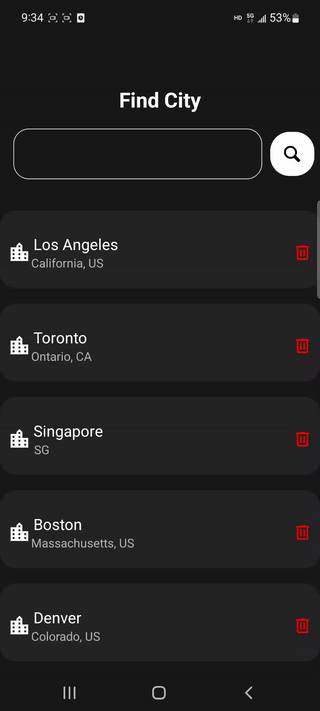

# Pixel Weather

Pixel Weather is a minimal, simplistic and nostalgic weather app, built with [Expo](https://docs.expo.dev/) and [React Native](https://reactnative.dev/).

On start, the app asks for user's current location. If granted, the app will fetch and display weather data for that location. Users can tap each stat to see corresponding weather forecasts.

<div style="display:flex;flex-direction:row;align-items:center;gap:50px;">

<div style="border:0;padding-left:1px;background:linear-gradient(to bottom, transparent, #021C55, transparent);height:50vh;"></div>

</div>

## Download

### Android

Scan the QR code below to download and install the android distribution (`.apk`) on your phone.


### iOS

Download the latest release and open it in your iOS simulator.

## Features

- Big component sizes, designed for simplicity and accessibility.
- Dark theme support.
- Varying colors for different weather stat levels.
- Display local time for cities around the world.
- Provide daily forecast for up to 8 days, hourly forecast for up to 48 hours.
- Provide air quality info.

## Dependencies

This project uses the following packages and libraries:

- [`React Navigation`](https://reactnavigation.org/), for navigating different screens.
- [`expo-location`](https://docs.expo.dev/versions/latest/sdk/location/), for getting user's current location.
- [`axios`](https://axios-http.com/), for making API requests.
- [`AsyncStorage`](https://react-native-async-storage.github.io/async-storage/docs/usage/), for saving locations locally on user's phone.
- [`lottie-react-native`](https://github.com/lottie-react-native/lottie-react-native), for loading animation during data fetching.
- [`react-native-flash-message`](https://github.com/lucasferreira/react-native-flash-message), for displaying messages.
- [`Sentry`](https://sentry.io/), for error logging in production.

## API Providers

This weather app uses data from the following two sources:

- [OpenWeather](https://openweathermap.org/), for weather data;
- [World Air Quality Index Project](https://aqicn.org/), for air quality data.


## How to Build

1. `git clone` this repo to your local machine.

2. `cd` to the folder. Run

    ```shell
    npm install
    ```
    to install all dependencies.

3. Apply for API keys from the two data source providers mentioned above. You may need to provide your credit card info for weather data subscription. Create `.env` in the root folder, and put your API keys into this file, like

    ```
    WEATHER_KEY=your-key-string
    AIR_KEY=your-key-string
    ```

4. Run

    ```shell
    npm start
    ```

    or

    ```shell
    expo start
    ```

    You will then see a QR code in the terminal. Open the [Expo Go](https://expo.dev/client) app on your phone, scan the QR code to run this project on your phone. 


## More Screenshots

<div style="display:flex;flex-direction:row;gap:20px;margin-bottom:50px">
    <div style="display:flex;flex-direction:column;align-items:center;gap:10px">
    
    <span style="font-weight:bold">Hourly Forecast</span>
    </div>
    <div style="display:flex;flex-direction:column;align-items:center;gap:10px">
    
    <span style="font-weight:bold">Wind Forecast</span>
    </div>
    <div style="display:flex;flex-direction:column;align-items:center;gap:10px">
    
    <span style="font-weight:bold">Humidity Forecast</span>
    </div>
</div>

<div style="display:flex;flex-direction:row;gap:20px;margin-bottom:50px">
    <div style="display:flex;flex-direction:column;align-items:center;gap:10px">
    
    <span style="font-weight:bold">Add City</span>
    </div>
    <div style="display:flex;flex-direction:column;align-items:center;gap:10px">
    
    <span style="font-weight:bold">Delete City</span>
    </div>
    <div style="display:flex;flex-direction:column;align-items:center;gap:10px">
    
    <span style="font-weight:bold">AQI Info</span>
    </div>
</div>

<div style="display:flex;flex-direction:row;gap:20px">
    <div style="display:flex;flex-direction:column;align-items:center;gap:10px">
    
    <span style="font-weight:bold">Light theme, home</span>
    </div>
    <div style="display:flex;flex-direction:column;align-items:center;gap:10px">
    
    <span style="font-weight:bold">Light theme, humidity forecast</span>
    </div>
    <div style="display:flex;flex-direction:column;align-items:center;gap:10px">
    
    <span style="font-weight:bold">Light theme, location panel</span>
    </div>
</div>


## TODO

- [ ] Improve air quality info page.
- [ ] Add sunrise and sunset time page.
- [ ] Add support for unit and format conversion.
- [ ] Implement drag-and-sort for saved locations.