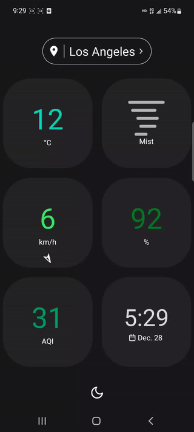

# Pixel Weather

Pixel Weather is a minimal weather app, built with [Expo](https://docs.expo.dev/) and [React Native](https://reactnative.dev/).

On start, the app asks for user's current location. If granted, the app will fetch and display weather data for that location. Users can tap each stat to see corresponding weather forecasts.

<p align="left">
  
&nbsp; &nbsp; &nbsp; &nbsp;
  
</p>

## Features

- 📱Big component sizes, designed for simplicity and accessibility.
- 🌙Dark theme support.
- 🍭Varying colors for different weather stat levels.
- 🕓Display local time for cities around the world.
- 📈Provide daily forecast for up to 8 days, hourly forecast for up to 48 hours.
- 🌫Provide air quality info.

## Dependencies

This project uses the following packages and libraries:

- [`React Navigation`](https://reactnavigation.org/), for navigating different screens.
- [`expo-location`](https://docs.expo.dev/versions/latest/sdk/location/), for getting user's current location.
- [`axios`](https://axios-http.com/), for making API requests.
- [`AsyncStorage`](https://react-native-async-storage.github.io/async-storage/docs/usage/), for saving locations locally on user's phone.
- [`lottie-react-native`](https://github.com/lottie-react-native/lottie-react-native), for loading animation during data fetching.
- [`react-native-flash-message`](https://github.com/lucasferreira/react-native-flash-message), for displaying messages.
- [`Sentry`](https://sentry.io/), for error logging in production.

## API Providers

This weather app uses data from the following two sources:

- [OpenWeather](https://openweathermap.org/), for weather data;
- [World Air Quality Index Project](https://aqicn.org/), for air quality data.


## How to Build

1. `git clone` this repo to your local machine.

2. `cd` to the folder. Run

    ```shell
    npm install
    ```
    to install all dependencies.

3. Apply for API keys from the two data source providers mentioned above. You may need to provide your credit card info for weather data subscription. Create `.env` in the root folder, and put your API keys into this file, like

    ```
    WEATHER_KEY=your-key-string
    AIR_KEY=your-key-string
    ```

4. Run

    ```shell
    npm start
    ```

    or

    ```shell
    expo start
    ```

    You will then see a QR code in the terminal. Open the [Expo Go](https://expo.dev/client) app, scan the QR code to run this project on your phone. 


5. Run 

    ```shell
    eas build --profile preview --platform android
    ``` 

    to build the android app. After completion, go to [expo.dev](https://expo.dev) to download the `.apk` file.

## More Screenshots

| Hourly Forecast | Wind Forecast | Humidity Forecast |
| ------------- | ------------- | ------------- |
|   |   |  |

| Add City | Delete City | AQI Info |
| ------------- | ------------- | ------------- |
|   |   |  |

| Light theme - home | Light theme - humidity forecast | Light theme - location panel |
| ------------- | ------------- | ------------- |
|   |   |  |


## TODO

- [ ] Improve air quality info page.
- [ ] Add sunrise and sunset time page.
- [ ] Add support for unit and format conversion.
- [ ] Implement drag-and-sort for saved locations.